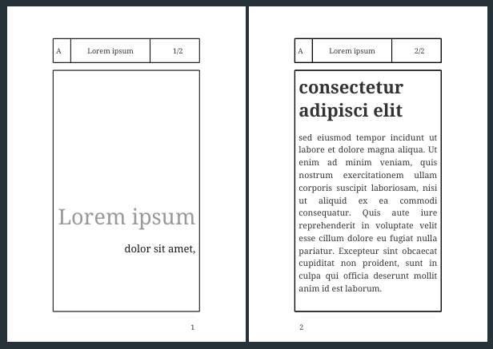

<a name="readme-top"></a>

<!-- PROJECT SHIELDS -->

[![GitHub release (latest SemVer)][release-shield]][release-url][![GitHub License][license-shield]][license-url]

[![Paypal][Paypal-shield]][Paypal-url][![BuyMeACoffee][BuyMeACoffee-sheild]][BuyMeACoffee-url]

<!-- PROJECT LOGO -->
<br />
<div align="center">
  <a href="https://github.com/Shumpei-Tanaka/Asciidoc-BorderInMargin">
    
  </a>

  <h3 align="center">AsciiDoc Border In Margin</h3>

  <p align="center">
    Script to write border lines in page margin.
    <br />
    <a href="https://github.com/Shumpei-Tanaka/Asciidoc-BorderInMargin/issues">Report Bug</a>
    ·
    <a href="https://github.com/Shumpei-Tanaka/Asciidoc-BorderInMargin/issues">Request Feature</a>
  </p>
  <p align="center">
    <a href="/README.md">English</a>
  </p>
</div>

<!-- TABLE OF CONTENTS -->

1. [Demo](#demo)
2. [Usage](#usage)
3. [Rules](#rules)
4. [Contributing](#contributing)
    1. [How to contributing](#how-to-contributing)
5. [License](#license)
6. [Contact](#contact)
7. [Say Thank You](#say-thank-you)

<p align="right">(<a href="#readme-top">back to top</a>)</p>

<!-- ### Built With -->
<!-- Show Demo -->

## Demo

Script results looks like below.


<p align="right">(<a href="#readme-top">back to top</a>)</p>

<!-- USAGE EXAMPLES -->

## Usage

load script with `-r` option of `asciidoctor-pdf`.

command to try is below.

```sh
asciidoctor-pdf sample.adoc -r ./asciidoc-settings/borderHolePage.rb
```

<p align="right">(<a href="#readme-top">back to top</a>)</p>

<!-- Rules -->

## Rules

This repository follows rules below.

-   [Github-Flow][github-flow-url]
-   [Semantic Versioning][semver-url]

<p align="right">(<a href="#readme-top">back to top</a>)</p>

<!-- CONTRIBUTING -->

## Contributing

Any contributions you make are **greatly appreciated**.

If you have a suggestion that would make this better, please fork the repo and create a pull request. You can also simply open an issue with the tag "enhancement".
Don't forget to give the project a star! Thanks!

### How to contributing

1. Fork the Project
2. Create your Feature Branch (`git checkout -b AmazingFeature`)
3. Commit your Changes (`git commit -m 'Add some AmazingFeature'`)
4. Push to the Branch (`git push origin AmazingFeature`)
5. Open a Pull Request

<p align="right">(<a href="#readme-top">back to top</a>)</p>

<!-- LICENSE -->

## License

The source code is licensed MIT. See [LICENSE.md][license-url].

<p align="right">(<a href="#readme-top">back to top</a>)</p>

<!-- CONTACT -->

## Contact

-   Shumpei-Tanaka
    -   s6.tanaka.pub@gmail.com
    -   S6T5: my homepage [https://shumpei-tanaka.github.io/](https://shumpei-tanaka.github.io/)

<p align="right">(<a href="#readme-top">back to top</a>)</p>

<!-- Suppurt -->

## Say Thank You

If my works feels you helpful, I would be happy to have your support for me :D

links are below.

-   [https://www.paypal.me/s6tanaka][Paypal-url]
-   [https://www.buymeacoffee.com/s6tanaka][BuyMeACoffee-url]

[![Paypal][Paypal-shield]][Paypal-url][![BuyMeACoffee][BuyMeACoffee-sheild]][BuyMeACoffee-url]

<p align="right">(<a href="#readme-top">back to top</a>)</p>

<!-- MARKDOWN LINKS & IMAGES -->

[release-shield]: https://img.shields.io/github/v/release/Shumpei-Tanaka/Asciidoc-BorderInMargin?style=flat-square&sort=semver
[release-url]: https://github.com/Shumpei-Tanaka/Asciidoc-BorderInMargin/releases/latest
[license-shield]: https://img.shields.io/github/license/Shumpei-Tanaka/Asciidoc-BorderInMargin?flat-square
[license-url]: /LICENSE.md
[contributors-shield]: https://img.shields.io/github/contributors/Shumpei-Tanaka/Asciidoc-BorderInMargin.svg?style=flat-square
[contributors-url]: https://github.com/Shumpei-Tanaka/Asciidoc-BorderInMargin/graphs/contributors
[forks-shield]: https://img.shields.io/github/forks/Shumpei-Tanaka/Asciidoc-BorderInMargin.svg?style=flat-square
[forks-url]: https://github.com/Shumpei-Tanaka/Asciidoc-BorderInMargin/network/members
[stars-shield]: https://img.shields.io/github/stars/Shumpei-Tanaka/Asciidoc-BorderInMargin.svg?style=flat-square
[stars-url]: https://github.com/Shumpei-Tanaka/Asciidoc-BorderInMargin/stargazers
[issues-shield]: https://img.shields.io/github/issues/Shumpei-Tanaka/Asciidoc-BorderInMargin.svg?style=flat-square
[issues-url]: https://github.com/Shumpei-Tanaka/Asciidoc-BorderInMargin/issues
[Paypal-shield]: https://img.shields.io/badge/paypal.me-s6tanaka-white?style=flat-square&logo=paypal
[Paypal-url]: https://paypal.me/s6tanaka
[BuyMeACoffee-sheild]: https://img.shields.io/badge/buy_me_a_coffee-s6tanaka-white?style=flat-square&logo=buymeacoffee&logocolor=#FFDD00
[BuyMeACoffee-url]: https://www.buymeacoffee.com/s6tanaka
[github-flow-url]: https://docs.github.com/en/get-started/quickstart/github-flow
[semver-url]: https://semver.org/
